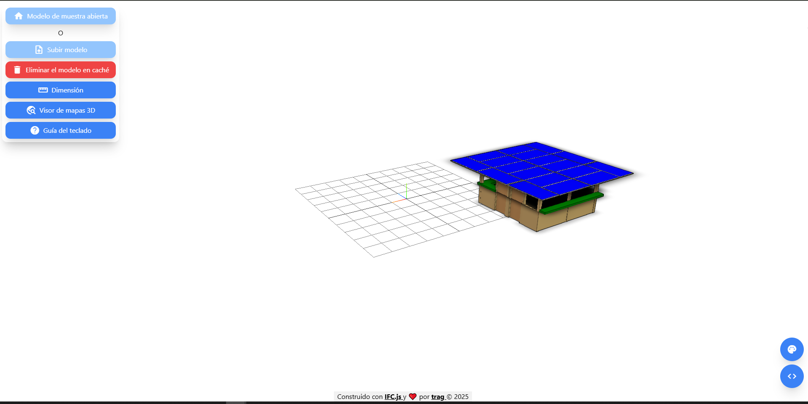

# BIM-GIS Viewer


Pruébalo: [https://extraordinary-belekoy-ee7fa8.netlify.app](https://extraordinary-belekoy-ee7fa8.netlify.app](https://cdebimtrag.netlify.app/)

Ver demostración: [https://youtu.be/4PvLQ1qMmKI](https://youtu.be/4PvLQ1qMmKI)

## Características principales

- Coloque su modelo donde desee o muévalo aleatoriamente (integración BIM-GIS)
- Admite medición 3D
- Lea las propiedades IFC haciendo clic en los elementos
- Añada planos de recorte para encontrar elementos internos
- Cambie el color de fondo del visor con una paleta de colores
- Preprocesamiento, gestión de memoria y compatibilidad con multihilo

## Cómo usar

Obtén una clave API de Mapbox gratis en [https://www.mapbox.com/](https://www.mapbox.com/)

```bash
# Clone this repository
$ git clone https://github.com/helenkwok/bim-gis-viewer.git

# Go into the repository
$ cd bim-gis-viewer

# Install dependencies
$ npm install

# Run Rollup
$ npm run build
```

Almacene su API en .env y utilice [Live Server](https://marketplace.visualstudio.com/items?itemName=ritwickdey.LiveServer) para servir la aplicación.

## Créditos

Este software utiliza los siguientes paquetes de código abierto:

- [IFC.js](https://ifcjs.github.io/info/)
- [Three.js](https://threejs.org/)
- [Mapbox GL JS](https://www.mapbox.com/mapbox-gljs)
- [Node.js](https://nodejs.org/)
- [Nodemon](https://nodemon.io/)
- [Dexie.js](https://dexie.org/)
- [Rollup](https://rollupjs.org/guide/en/)
- [Dotenv](https://dotenv.org/)
